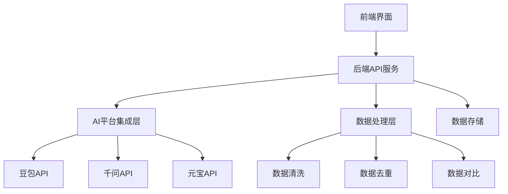
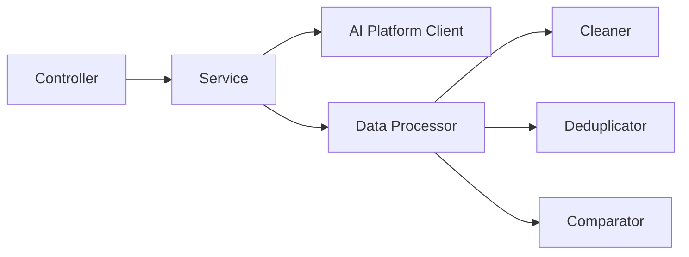
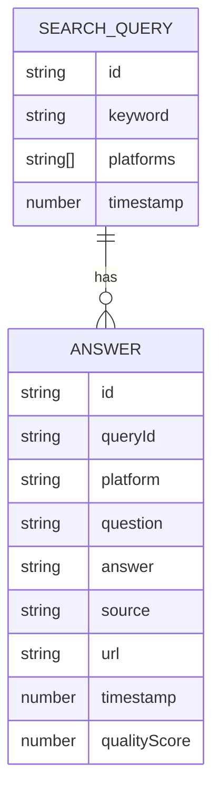

## 1. Architecture Design



## 2. Technology Description
- Frontend: React@18 + TypeScript + TailwindCSS@3 + Vite
- Backend: Express@4 + TypeScript
- Charts: Chart.js + react-chartjs-2
- Initialization Tool: vite-init
- CLI: Commander.js + Inquirer

## 3. Route Definitions
| Route | Purpose |
|-------|---------|
| / | 首页，搜索和示例展示 |
| /results | 查询结果页 |
| /api/search | 搜索API接口 |
| /api/health | 健康检查接口 |

## 4. API Definitions

### Search Request
```typescript
interface SearchRequest {
  keyword: string;
  platforms: string[];
}
```

### Search Response
```typescript
interface Answer {
  id: string;
  platform: string;
  question: string;
  answer: string;
  source: string;
  url: string;
  timestamp: number;
  qualityScore: number;
}

interface SearchResponse {
  success: boolean;
  data: Answer[];
  timestamp: number;
}
```

## 5. Server Architecture Diagram



## 6. Data Model

### 6.1 Data Model Definition


### 6.2 Sample Data
```typescript
const sampleAnswers: Answer[] = [
  {
    id: '1',
    platform: '豆包',
    question: '什么是人工智能？',
    answer: '人工智能是计算机科学的一个分支，它企图了解智能的实质，并生产出一种新的能以人类智能相似的方式做出反应的智能机器。',
    source: '豆包AI',
    url: 'https://www.doubao.com',
    timestamp: Date.now(),
    qualityScore: 85
  },
  {
    id: '2',
    platform: '千问',
    question: '什么是人工智能？',
    answer: '人工智能（AI）是指由人制造出来的机器所表现出来的智能，通常AI是指通过普通计算机程序的手段实现的类人智能技术。',
    source: '千问AI',
    url: 'https://qianwen.aliyun.com',
    timestamp: Date.now(),
    qualityScore: 88
  }
];
```

