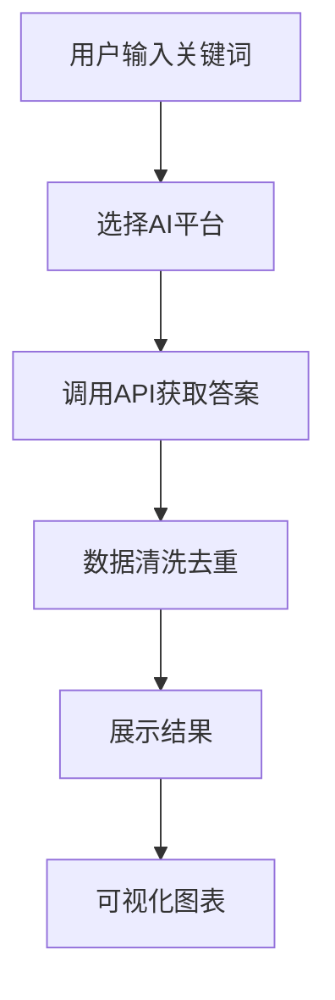

## 1. Product Overview
AI自动答题采集与对比工具，支持从豆包、千问、元宝等AI平台获取答案，提供数据清洗、去重、对比和可视化功能。
- 解决用户需要多平台答题对比的需求，提供统一的查询接口和结果展示
- 目标用户为学生、研究人员和需要知识检索的人群

## 2. Core Features

### 2.1 User Roles
| Role | Registration Method | Core Permissions |
|------|---------------------|------------------|
| Normal User | No registration | Browse and use all features |

### 2.2 Feature Module
1. **首页**: 关键词搜索、示例数据展示、快速开始
2. **查询结果页**: 答案列表、数据对比、可视化图表、来源标注
3. **命令行工具**: 批量查询、数据导出、配置管理

### 2.3 Page Details
| Page Name | Module Name | Feature description |
|-----------|-------------|---------------------|
| 首页 | 搜索区域 | 输入关键词，选择AI平台，开始查询 |
| 首页 | 示例数据 | 展示预置的问题和答案示例 |
| 查询结果页 | 答案列表 | 展示各平台的答案，包含来源、时间、质量评分 |
| 查询结果页 | 数据对比 | 横向对比不同平台的答案 |
| 查询结果页 | 可视化图表 | 展示答案来源分布、质量对比等图表 |

## 3. Core Process
用户输入关键词 → 选择AI平台 → 系统调用各平台API获取答案 → 数据清洗去重 → 展示结果和图表

## 4. User Interface Design
### 4.1 Design Style
- 主色调：深蓝色 (#1e40af)，辅助色：青色 (#06b6d4)
- 按钮风格：圆角矩形，悬停有阴影效果
- 字体：Inter 作为主要字体，代码使用 JetBrains Mono
- 布局风格：卡片式布局，左右分栏
- 图标风格：使用 lucide-react 线性图标

### 4.2 Page Design Overview
| Page Name | Module Name | UI Elements |
|-----------|-------------|-------------|
| 首页 | 搜索区域 | 大标题、搜索框、平台选择、提交按钮 |
| 首页 | 示例数据 | 卡片展示，包含问题和答案预览 |
| 查询结果页 | 答案列表 | 卡片式列表，包含平台标识、答案内容、操作按钮 |
| 查询结果页 | 可视化图表 | 饼图、柱状图展示数据分布 |

### 4.3 Responsiveness
桌面优先设计，适配平板和移动设备，触摸操作优化

